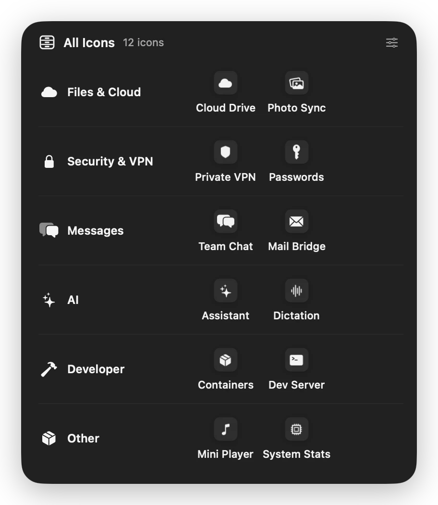
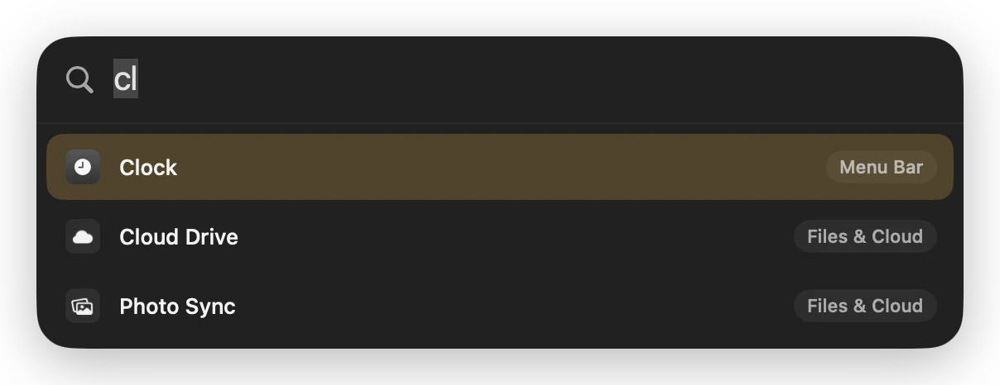
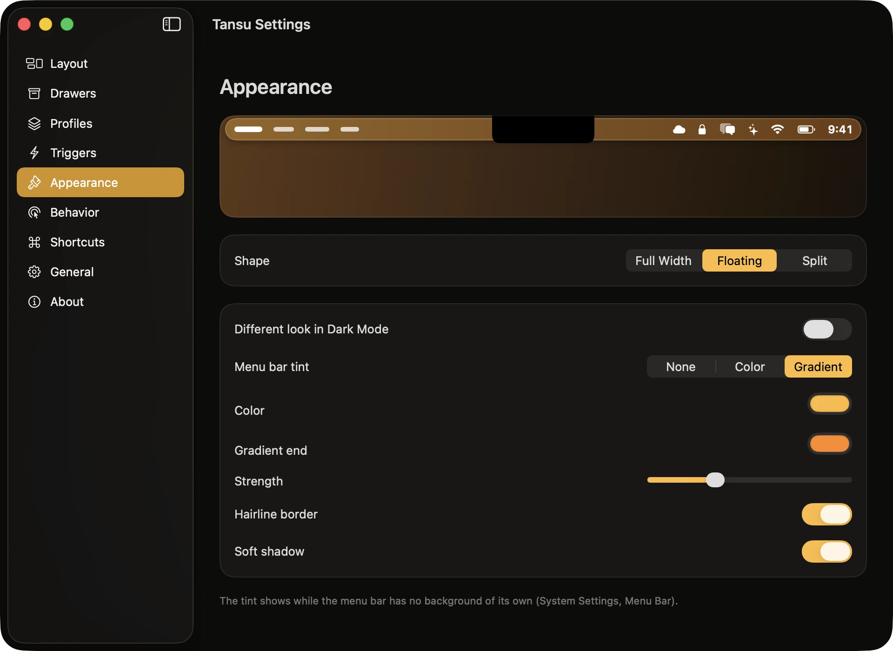
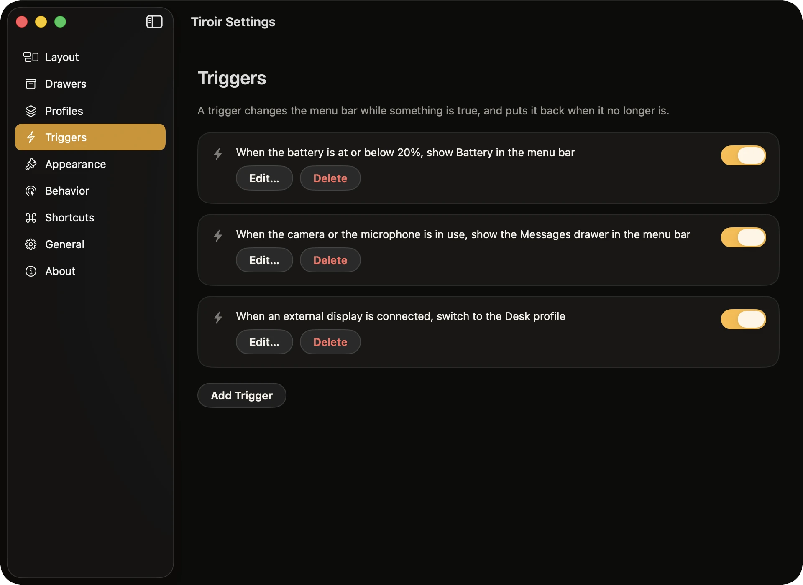

<p align="center">
  <picture>
    <source media="(prefers-color-scheme: dark)" srcset="docs/brand/readme-header-dark.png">
    
  </picture>
</p>

<p align="center">
  <a href="https://github.com/ruben4reall/tiroir/releases/latest"></a>
  <a href="LICENSE"></a>
  
  
  
  
  <a href="https://github.com/ruben4reall/tiroir/actions/workflows/ci.yml"></a>
</p>

# Tiroir

**Your menu bar, in drawers.**

[Website](https://gettiroir.vercel.app) · [Download for Mac](https://github.com/ruben4reall/tiroir/releases/latest/download/Tiroir.dmg) · [Changelog](CHANGELOG.md) · [Report a problem](https://github.com/ruben4reall/tiroir/issues)

Tiroir is French for drawer, and each drawer holds one kind of thing. Tiroir does that for the icons on the right
of your Mac's menu bar. Your cloud apps go in one drawer, your VPN and passwords in another, your chat apps in a third.
Each drawer shows in the menu bar as a single icon, and a click opens a small panel right under it, with the drawer's
apps. A click on one opens its own menu, as if its icon had been there all along.

Tiroir is free and open source, written in Swift for macOS 26 Tahoe and macOS 27. It sorts your menu bar for you in one
click, fits a MacBook's notch, and asks for one permission.

<p align="center">
  
</p>

## Why Tiroir

- **A menu bar you can read.** On a MacBook, the notch leaves room for about a dozen icons, and the rest vanish behind
  it. Tiroir puts them in drawers, so every app is one click away and the menu bar stays calm.
- **Sorted for you.** Smart Sort reads what each app is for and proposes drawers in one click. You adjust, it applies.
- **Nothing lost, ever.** Quit Tiroir, or let it crash, and every icon is back where it was.
- **Private and light.** One permission, no account, no telemetry, about 16 MB of memory at rest, and no timer running
  while nothing changes.

## What it does

### Drawers

Each drawer is one icon in the menu bar, drawn like macOS's own: about 390 symbols by theme, an emoji, or a few
letters, with its name and count if you like. A click opens a glass panel right under it. Arrow keys, Return, Escape
and typing work in every drawer; a right-click moves an icon to another drawer, keeps it in the menu bar or hides it.

When you open an app from a drawer, its real icon comes right next to the drawer's for the time its menu is open, then
goes back to its own place among the hidden icons, even beside the notch. Menus, popovers, panels and full-screen
windows all count as open.

### Smart Sort

Tiroir reads what each app is for (a catalog of 244 menu bar apps, the developer, what the app declares) and proposes
drawers: Files & Cloud, Security & VPN, Messages, AI, Developer, Music & Video, Devices, and more. Or one drawer per
developer, or everything in one drawer. You see the result as a preview of your menu bar before it applies, and can
drag any icon elsewhere. The clock, Control Center, Battery, Wi-Fi and Sound stay in view.

New icons sort themselves: an app you install tomorrow joins its drawer, stays in the menu bar or hides, as you chose.

<p align="center">
  
  
</p>

### Show every icon

- A click on Tiroir's icon opens the All drawer: every drawer and every hidden icon, in one panel.
- To see every icon in the menu bar itself: an Option-click on Tiroir's icon, a shortcut, or, if you turn them on, a
  rest, a click or a swipe on an empty part of the menu bar.
- They hide again a few seconds after the pointer leaves the menu bar, or with the same gesture.
- Beside the notch, where not every icon fits, the All drawer can show them instead.

### Search and shortcuts

- **Search.** ⌃⌥⌘Space, two letters, Return: any icon's menu opens, wherever it lives.
- **Icon shortcuts.** Give any icon a shortcut: it opens that icon's menu, in the menu bar, in a drawer or hidden.
- **Focus.** ⌃⌥⌘F leaves only the clock and Control Center, for a presentation or a screen share, and brings
  everything back.
- Record your own shortcuts for search, Focus, the All drawer, every icon, each drawer and each profile.

<p align="center">
  
</p>

### Beside the notch

Settings draws your menu bar at its real size, notch included, and measures the room left beside it. When icons no
longer fit, it says so and moves the overflow into a drawer in one click, or by itself if you want. The space between
icons (Standard, Snug, Compact or Tight) lets more of them fit.

<p align="center">
  
</p>

### Appearance

A tint for the menu bar (a color or a gradient), a hairline and a soft shadow, previewed live, in three shapes: edge to
edge, a floating bar, or split in two, one piece behind the app menus and one behind the icons, on each side of the
notch. Dark Mode can have a look of its own. The tint shows while the menu bar has no background of its own (System
Settings, Menu Bar).

<p align="center">
  
</p>

### Profiles and triggers

- **Profiles.** Save the whole setup of your menu bar (the drawers, where each icon goes, the appearance) under a name,
  and switch from Tiroir's menu, from Settings or with a shortcut: one for work, one for a talk.
- **Triggers.** While an app is open or in front, on battery or below a battery level, with an external display, during
  the hours you choose, or while the camera or microphone is on: switch to a profile, show a drawer or one icon, or turn
  on Focus. When the condition ends, the menu bar goes back. Nothing polls: macOS tells Tiroir when something changes.

<p align="center">
  
</p>

### Careful with your menu bar

- Tiroir waits for a pause of your pointer and keyboard before it moves an icon, and never fights you for the pointer.
- It never hides an icon that should show: if one cannot be moved, every icon stays in view and Tiroir tries again.
- It keeps its place from one launch to the next, so a restart moves nothing.
- An icon opened from a drawer goes back to its own place, so the order of your icons stays as it was.
- It stays clear of the notch and of the apps drawn around it, where macOS drops icons unpredictably.
- Quit it, or let it crash, and every icon is back in the menu bar.

### Also

- **Ten languages:** English, French, German, Italian, Spanish, Brazilian Portuguese, Dutch, Japanese, Korean and
  Simplified Chinese, in the words macOS itself uses. Tiroir follows your Mac's language, or the one you choose for it in
  System Settings, General, Language & Region.
- **Your setup in a file:** export your drawers, profiles, triggers and settings, and import them on another Mac.
- **Accessible:** VoiceOver labels on every control, the keyboard in every drawer and in search, and respect for Reduce
  Motion, Reduce Transparency and Increase Contrast.

## Install

### Download

1. [Download Tiroir](https://github.com/ruben4reall/tiroir/releases/latest/download/Tiroir.dmg), open the disk image
   and drag Tiroir to Applications.
2. Open Tiroir. A short welcome asks for Accessibility, proposes your drawers, and you are done.

Releases are signed with a Developer ID and notarized by Apple. On macOS 27, Tiroir must run from the Applications
folder: it offers to move itself there.

### Homebrew

```sh
brew install --cask ruben4reall/tap/tiroir
```

### Updates

Tiroir updates itself with [Sparkle](https://sparkle-project.org). The welcome asks whether to check automatically; you
can change your mind in Settings, General. Every update is signed with Tiroir's own key.

### Uninstall

Quit Tiroir (right-click any drawer, Quit Tiroir): every icon comes back to the menu bar. Move Tiroir to the Trash. Its
settings are in `~/Library/Preferences/ch.rubencatalao.tiroir.plist`. With Homebrew:
`brew uninstall --cask --zap tiroir`.

## Using Tiroir

| To | Do |
|---|---|
| Open a drawer | Click its icon: the panel opens right under it |
| Open an app's menu | Click the app in the drawer, or press Return on it |
| Find any icon | ⌃⌥⌘Space, two letters, Return |
| See every drawer and hidden icon | Click Tiroir's icon: the All drawer |
| See every icon in the menu bar | Option-click Tiroir's icon, or use the shortcut you set |
| Move an icon to another drawer | Right-click it in a drawer, or drag it in Settings, Layout |
| Keep an icon in the menu bar, or hide it | Right-click it in a drawer, or drag it to the Menu Bar or Hidden card |
| Present or share your screen | ⌃⌥⌘F turns Focus on, and off again |
| Change a drawer's icon, name or order | Settings, Drawers |
| Reach Settings | Right-click any drawer, or open Tiroir again from Applications |

## How it works

macOS changed how the menu bar is built between 26 and 27, so Tiroir has two engines behind one interface.

| | macOS 26 Tahoe | macOS 27 |
|---|---|---|
| Hiding an icon | An invisible divider pushes the icons on its left off screen | macOS is asked to leave the app out of the menu bar |
| What can be hidden | Any icon, one by one | Whole apps: an app with two icons hides both |
| Arranging | Command-drags, the way you would do it yourself; the pointer is hidden while an icon moves | Nothing moves |
| Opening an icon from a drawer | It comes next to the drawer's icon while its menu is open, then goes back to its own place | It is let through for the time its menu is open |
| While icons are hidden | Nothing else changes | macOS also hides Focus and the camera and microphone indicators |

On macOS 26, the divider remembers its place between launches, and one drag of the divider replaces many drags of
icons whenever it can: after a launch, or to turn Focus on, it is usually a single move. Every drop is checked, and a
move that does not land is tried again another way, then reported.

macOS 27 support is beta until it has been tried on more Macs: please report anything odd.

## Performance

At rest, Tiroir uses about 16 MB of memory and no measurable processor time: it runs no timer and polls nothing, and
wakes only when an app starts or quits, a display changes, or you click. Measured with
[`scripts/bench.sh`](scripts/bench.sh) on a MacBook Pro with M3 Pro and macOS 26.5, after one idle minute. Settings,
General shows the live figure.

## Permissions

- **Accessibility**, and nothing else: to see which app owns each icon, to open icons for you and, on macOS 26, to
  move them. Without it, Tiroir moves nothing and says so.

Tiroir never asks for Screen Recording or Input Monitoring, and never takes a picture of your screen: drawers show each
app's own icon.

## Privacy

- No account, no telemetry, no analytics, no crash reports.
- One network connection: the update check, which you can turn off. Sparkle's system profile is off.
- Settings stay on your Mac, in one preferences file. Tiroir never writes in other apps' settings; the space between
  icons, if you change it, is a setting of macOS itself.

[SECURITY.md](SECURITY.md) lists everything Tiroir touches on your Mac.

## Compared

As of September 2026, from each app's website, repository and release notes. "Not verified" means we could not confirm
it either way.

| | Tiroir | Bartender 6 | Bartender 7 | Ice | Thaw | Hidden Bar |
|---|---|---|---|---|---|---|
| Price | Free | $20 | $24.99, or $19.99 a year | Free | Free | Free |
| License | MIT | Closed | Closed | GPL-3.0 | GPL-3.0 | MIT |
| macOS 26 Tahoe | Yes | Yes | Not yet | Beta only | Yes | Yes |
| macOS 27 | Beta | No | Yes | No | Alpha | Yes, per app |
| Groups as one icon | Yes | Yes | Not on macOS 27 | No | No | No |
| Automatic sorting | Smart Sort | No | No | No | No | No |
| Profiles | Yes | Presets | Yes | Planned | Yes | No |
| Triggers | Yes | Yes | Yes | Planned | Yes | No |
| Search | Yes | Yes | Not verified | Yes | Yes | No |
| Space between icons | macOS 26 | Yes | Not verified | Beta | Yes | No |
| Menu bar shapes | Yes | Yes | Yes | Yes | Yes | No |
| Screen Recording | Not needed | Required | Optional | Optional | Optional | Not needed |

Ice's last stable release dates from October 2024; Thaw is a fork of Ice. Corrections are welcome.

## Compatible Macs

- macOS 26 Tahoe or macOS 27, Apple silicon and Intel (Intel Macs stop at macOS 26).
- Any Mac and any display. With a notch, Tiroir measures the room beside it; with several displays, a drawer opens on
  the one you clicked.

## Private macOS APIs

Tiroir uses two private macOS functions. Each is looked up at run time in one file,
[`PrivateAPI.swift`](Packages/TiroirKit/Sources/TiroirSystem/PrivateAPI.swift): if a macOS update removes one, its
feature turns off, Settings says so, and nothing crashes.

| Feature | Functions | Why |
|---|---|---|
| Hiding apps on macOS 27 | `MBAssessmentModeConfiguration`, `MBAssessmentModeAssertion` (MenuBarClientCore) | macOS 27 draws the whole menu bar in one agent; this restriction is the only way another app can leave icons out. Technique from [MenuBarHider](https://github.com/happy666End/MenuBarHider) (MIT) and [Ellipsis](https://github.com/ronny/ellipsis) (Apache-2.0), rewritten. |
| Hiding the pointer while icons move on macOS 26 | `SLSSetConnectionProperty` with `SetsCursorInBackground` (SkyLight) | Lets Tiroir hide the pointer while another app is in front. Without it, the pointer blinks. |

## Build from source

You need Xcode 26 and [XcodeGen](https://github.com/yonaskolb/XcodeGen).

```sh
brew install xcodegen
git clone https://github.com/ruben4reall/tiroir.git
cd tiroir
swift test --package-path Packages/TiroirKit   # drawers, Smart Sort, both engines on a simulated menu bar
scripts/build.sh                               # prints the path of the Debug app
open .build/xcode/Build/Products/Debug/Tiroir.app
```

- Debug builds use the bundle identifier `ch.rubencatalao.tiroir.debug`, so they keep their own settings and their own
  Accessibility grant.
- Demo mode shows generic icons and never touches your menu bar or your settings: `-TiroirDemo YES`. With
  `-TiroirQuiet YES`, windows appear without taking the keyboard, for screenshots. `-TiroirWelcomeStep 2`,
  `-TiroirSettingsPane layout`, `-TiroirOpenDrawer 0` (or `all`) and `-TiroirSearch cl` open a given screen.
- Every visible word is in the String Catalog, in ten languages: after changing a `Strings` file, run
  `node scripts/sync-strings.mjs` and translate each new key into the nine other languages (the tests check that none
  is missing).
- `scripts/tests/run.sh` tests the release scripts and the documents; `scripts/release.sh` makes a disk image, ad hoc
  without a team, signed and notarized with one.

| Folder | What lives there |
|---|---|
| `Packages/TiroirKit/Sources/TiroirCore` | Drawers, layouts, Smart Sort and its catalog, profiles, triggers, planning. Foundation only, fully tested |
| `Packages/TiroirKit/Sources/TiroirSystem` | The two engines, Accessibility, events, shortcuts, private functions |
| `Packages/TiroirKit/Sources/TiroirUI` | Drawers, search, the welcome, Settings, the icon library, the ten languages |
| `Packages/TiroirKit/Sources/TiroirApp` | The coordinator that wires everything together |
| `App/` | Entry point, updates, the move to Applications |
| `brand/` | The icon, the wordmark, the tokens and their generators |
| `site/` | The website and the update feed |

## Credits

- Hiding on macOS 27: the technique of [MenuBarHider](https://github.com/happy666End/MenuBarHider) (MIT) and
  [Ellipsis](https://github.com/ronny/ellipsis) (Apache-2.0), rewritten.
- The divider on macOS 26: the technique of [Hidden Bar](https://github.com/dwarvesf/hidden) (MIT), rewritten.
- Updates by [Sparkle](https://sparkle-project.org) (MIT).

Licenses and notices: [THIRD-PARTY-NOTICES.md](THIRD-PARTY-NOTICES.md).

## Contributing

Bugs and ideas go to [issues](https://github.com/ruben4reall/tiroir/issues); pull requests are welcome. The easiest
one: teach Smart Sort an app it does not know, by adding its bundle identifier to
[`Catalog.json`](Packages/TiroirKit/Sources/TiroirCore/Resources/Catalog.json). [CONTRIBUTING.md](CONTRIBUTING.md) gives
the workflow and the promises every change keeps, and [SECURITY.md](SECURITY.md) how to report a vulnerability
privately.

## License

MIT. See [LICENSE](LICENSE).

Tiroir is not affiliated with Apple. Mac, macOS and MacBook are trademarks of Apple Inc. Bartender, Ice, Thaw and Hidden
Bar belong to their authors.
