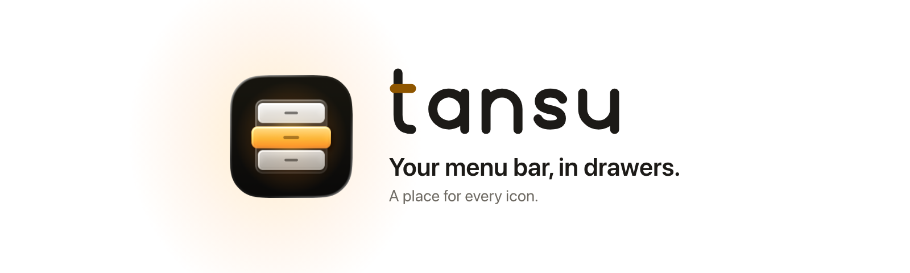
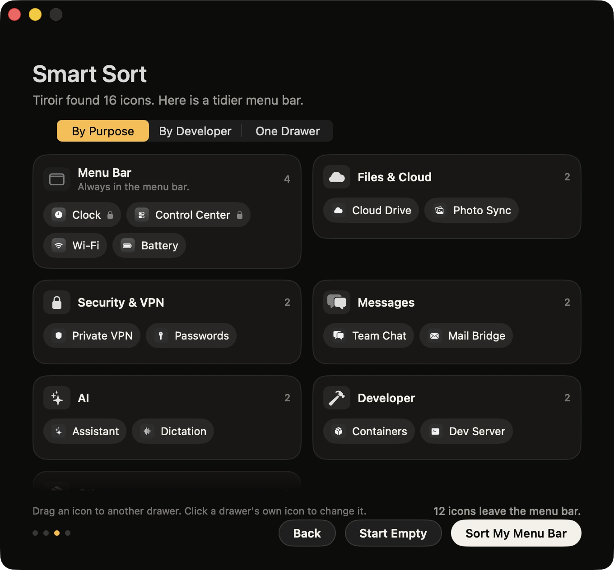
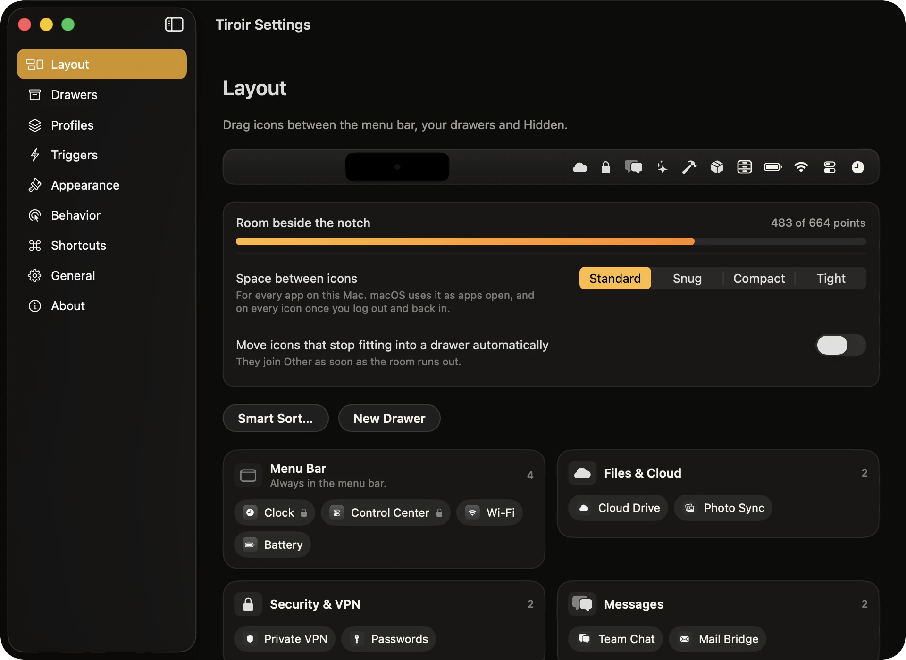

<p align="center">
  <picture>
    <source media="(prefers-color-scheme: dark)" srcset="docs/brand/readme-header-dark.png">
    
  </picture>
</p>

<p align="center">
  <a href="LICENSE"></a>
  
  
  
  <a href="https://github.com/ruben4reall/tansu/actions/workflows/ci.yml"></a>
</p>

# Tansu

**Your menu bar, in drawers.**

[Website](https://gettansu.vercel.app) · [Download for Mac](https://github.com/ruben4reall/tansu/releases/latest/download/Tansu.dmg) · [Changelog](CHANGELOG.md) · [Add an app to Smart Sort](Packages/TansuKit/Sources/TansuCore/Resources/Catalog.json)

A tansu is a Japanese chest of drawers: each drawer holds one kind of thing. Tansu does that for the icons on the right
of your Mac's menu bar. Your cloud apps go in one drawer, your VPN and passwords in another, your chat apps in a third;
each drawer shows in the menu bar as a single icon, and a click opens it.

Tansu is a free, open source Mac app, written in Swift for macOS 26 Tahoe and macOS 27. It sorts your menu bar for you
in one click, and asks for one permission.

<p align="center">
  
</p>

## What it does

- **Drawers.** Each drawer shows in the menu bar as one icon, drawn like macOS's own (390 to choose from, by theme),
  or an emoji, or a few letters. A click drops a glass panel with the drawer's apps; a click on one opens its real
  menu. Arrow keys, Return and typing work inside every drawer.
- **Smart Sort.** Tansu reads what each app is for (a catalog of 244 menu bar apps, their developer, what they
  declare) and proposes drawers: Files & Cloud, Security & VPN, Messages, AI, Developer, Music & Video, and more. Or
  one drawer per developer, or everything in one drawer. You see the result before it applies and can drag any icon
  elsewhere.
- **New icons sort themselves.** An app you install tomorrow lands in its drawer, or in the menu bar, or hidden:
  you choose once.
- **Search.** ⌃⌥⌘Space, two letters, Return: any icon's menu opens, wherever it lives.
- **Focus.** ⌃⌥⌘F leaves only the clock and Control Center, for a presentation or a screen share.
- **Beside the notch.** Settings draws your menu bar with the notch, measures the room left, says when icons no longer
  fit, and moves the overflow into a drawer in one click.
- **Appearance.** A tint for the menu bar, a color or a gradient, a hairline and a soft shadow.
- **Profiles.** Save the whole setup of your menu bar (the drawers, where each icon goes, the appearance) under a
  name, and switch from Tansu's menu or with a shortcut: one for work, one for a talk.
- **Triggers.** While an app is open or in front, on battery or below a battery level, with an external display, during
  the hours you choose, or while the camera or microphone is on: switch to a profile, show a drawer or one icon, or
  turn on Focus. When the condition ends, the menu bar goes back.
- **Nothing lost.** Quit Tansu, or let it crash, and every icon is back in the menu bar.

<p align="center">
  
  
</p>

## Install

### Download

1. [Download Tansu](https://github.com/ruben4reall/tansu/releases/latest/download/Tansu.dmg), open the disk image
   and drag Tansu to Applications.
2. Open Tansu. A short welcome asks for Accessibility, proposes your drawers, and you are done.

Releases are signed with a Developer ID and notarized by Apple. On macOS 27, Tansu must run from the Applications
folder: it offers to move itself there.

### Homebrew

```sh
brew install --cask ruben4reall/tap/tansu
```

### Updates

Tansu updates itself with [Sparkle](https://sparkle-project.org). The welcome asks whether to check automatically; you
can change your mind in Settings, General. Every update is signed with Tansu's own key.

### Uninstall

Quit Tansu (right-click any drawer, Quit Tansu): every icon comes back to the menu bar. Move Tansu to the Trash. Its
settings are in `~/Library/Preferences/ch.rubencatalao.tansu.plist`. With Homebrew:
`brew uninstall --cask --zap tansu`.

## How it works

macOS changed how the menu bar is built between 26 and 27, so Tansu has two engines behind one interface.

| | macOS 26 Tahoe | macOS 27 |
|---|---|---|
| Hiding an icon | An invisible divider pushes the icons on its left off screen | macOS is asked to leave the app out of the menu bar |
| What can be hidden | Any icon, one by one | Whole apps: an app with two icons hides both |
| Arranging | Command-drags, the way you would do it yourself; the pointer is hidden while an icon moves | Nothing moves |
| Opening an icon from a drawer | It comes next to the drawer's icon while its menu is open, then goes back | It is let through for the time its menu is open |
| While icons are hidden | Nothing else changes | macOS also hides Focus and the camera and microphone indicators |

macOS 27 support is beta until it has been tried on more Macs: please report anything odd.

## Permissions

- **Accessibility**, and nothing else: to see which app owns each icon, to open icons for you and, on macOS 26, to
  move them. Without it, Tansu moves nothing and says so.

Tansu never asks for Screen Recording and never takes a picture of your screen: drawers show each app's own icon.

## Privacy

- No account, no telemetry, no analytics, no crash reports.
- One network connection: the update check, which you can turn off. Sparkle's system profile is off.
- Settings stay on your Mac, in one preferences file. Tansu never writes in other apps' settings.

[SECURITY.md](SECURITY.md) lists everything Tansu touches on your Mac.

## Compared

As of September 2026, from each project's own pages and issue trackers.

| | Tansu | Bartender 6 and 7 | Ice | Thaw | Hidden Bar |
|---|---|---|---|---|---|
| Price | Free | Paid | Free | Free | Free |
| License | MIT | Closed | GPL-3.0 | GPL-3.0 | MIT |
| macOS 26 | Yes | 6: yes | Beta only | Yes | Yes |
| macOS 27 | Beta | 7: yes | No | Alpha | Per app |
| Groups as one menu bar icon | Yes | 6: yes; 7: not yet | No | No | No |
| Automatic sorting | Yes | No | No | No | No |
| Search | Yes | Yes | Yes | Yes | No |
| Screen Recording needed | Never | 6: yes; 7: optional | Yes | Optional | No |

## Compatible Macs

- macOS 26 Tahoe or macOS 27, Apple silicon and Intel.
- Any Mac and any display; the room beside the notch is measured on MacBooks that have one.

## Private macOS APIs

Tansu uses two private macOS functions. Each is looked up at run time in one file,
[`PrivateAPI.swift`](Packages/TansuKit/Sources/TansuSystem/PrivateAPI.swift): if a macOS update removes one, its
feature turns off, Settings says so, and nothing crashes.

| Feature | Functions | Why |
|---|---|---|
| Hiding apps on macOS 27 | `MBAssessmentModeConfiguration`, `MBAssessmentModeAssertion` (MenuBarClientCore) | macOS 27 draws the whole menu bar in one agent; this restriction is the only way another app can leave icons out. Technique from [MenuBarHider](https://github.com/happy666End/MenuBarHider) (MIT) and [Ellipsis](https://github.com/ronny/ellipsis) (Apache-2.0), rewritten. |
| Hiding the pointer while icons move on macOS 26 | `SLSSetConnectionProperty` with `SetsCursorInBackground` (SkyLight) | Lets Tansu hide the pointer while another app is in front. Without it, the pointer blinks. |

## Build from source

You need Xcode 26 and [XcodeGen](https://github.com/yonaskolb/XcodeGen).

```sh
brew install xcodegen
git clone https://github.com/ruben4reall/tansu.git
cd tansu
swift test --package-path Packages/TansuKit   # drawers, Smart Sort, both engines on a simulated menu bar
scripts/build.sh                               # prints the path of the Debug app
open .build/xcode/Build/Products/Debug/Tansu.app
```

- Debug builds use the bundle identifier `ch.rubencatalao.tansu.debug`, so they keep their own settings and their own
  Accessibility grant.
- Demo mode shows generic icons and never touches your menu bar or your settings: `-TansuDemo YES`. With
  `-TansuQuiet YES`, windows appear without taking the keyboard, for screenshots. `-TansuWelcomeStep 2`,
  `-TansuSettingsPane layout`, `-TansuOpenDrawer 0` (or `all`) and `-TansuSearch cl` open a given screen.
- Every visible word is in the String Catalog: after changing `Strings.swift`, run `node scripts/sync-strings.mjs`.
- `scripts/tests/run.sh` tests the release scripts and the documents; `scripts/release.sh` makes a disk image, ad hoc
  without a team, signed and notarized with one.

| Folder | What lives there |
|---|---|
| `Packages/TansuKit/Sources/TansuCore` | Drawers, layouts, Smart Sort and its catalog, planning. Foundation only, fully tested |
| `Packages/TansuKit/Sources/TansuSystem` | The two engines, Accessibility, events, shortcuts, private functions |
| `Packages/TansuKit/Sources/TansuUI` | Drawers, search, the welcome, Settings, the icon library |
| `Packages/TansuKit/Sources/TansuApp` | The coordinator that wires everything together |
| `App/` | Entry point, updates, the move to Applications |
| `brand/` | The icon, the wordmark, the tokens and their generators |
| `site/` | The website and the update feed |

## Credits

- Hiding on macOS 27: the technique of [MenuBarHider](https://github.com/happy666End/MenuBarHider) (MIT) and
  [Ellipsis](https://github.com/ronny/ellipsis) (Apache-2.0), rewritten.
- The divider on macOS 26: the technique of [Hidden Bar](https://github.com/dwarvesf/hidden) (MIT), rewritten.
- Updates by [Sparkle](https://sparkle-project.org) (MIT).

Licenses and notices: [THIRD-PARTY-NOTICES.md](THIRD-PARTY-NOTICES.md).

## Contributing

Bugs and ideas go to [issues](https://github.com/ruben4reall/tansu/issues); pull requests are welcome. The easiest
one: teach Smart Sort an app it does not know, by adding its bundle identifier to
[`Catalog.json`](Packages/TansuKit/Sources/TansuCore/Resources/Catalog.json). [CONTRIBUTING.md](CONTRIBUTING.md) gives
the workflow and the promises every change keeps, and [SECURITY.md](SECURITY.md) how to report a vulnerability
privately.

## License

MIT. See [LICENSE](LICENSE).

Tansu is not affiliated with Apple. Mac, macOS and MacBook are trademarks of Apple Inc. Bartender, Ice, Thaw and Hidden
Bar belong to their authors.
